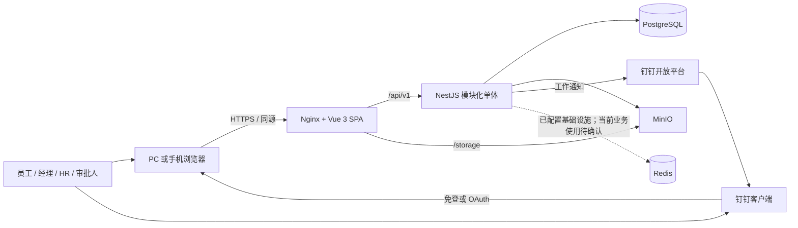
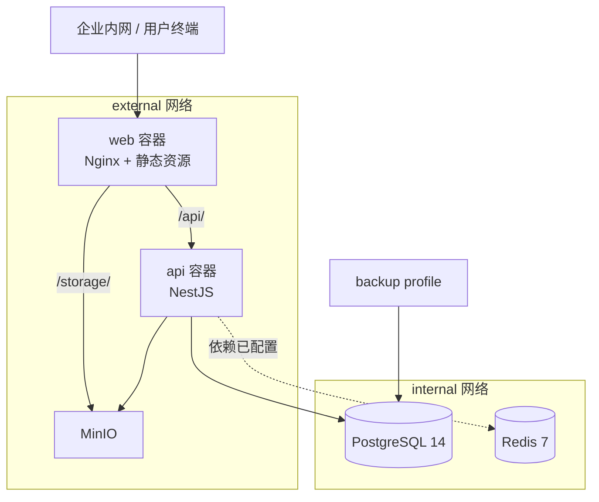
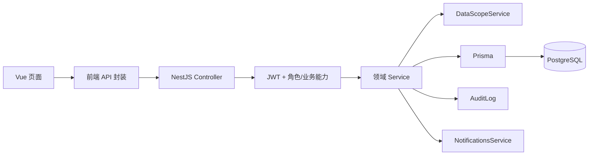
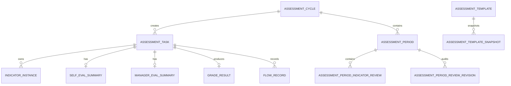
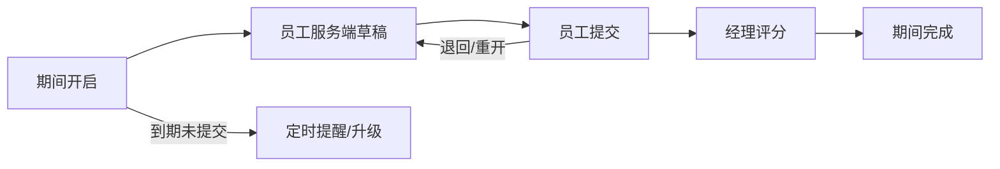
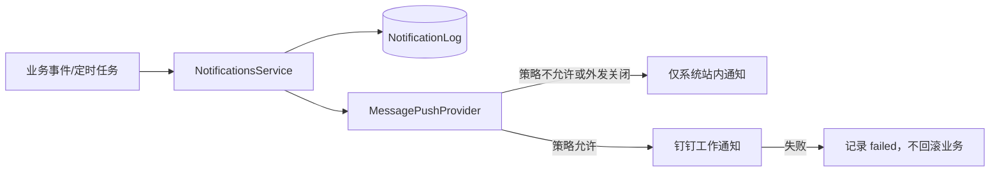
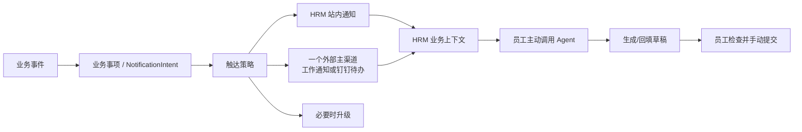

# KeyFord HRM 当前系统架构说明

> 文档日期：2026-09-04  
> 代码基线：`main` / `e4c1108`（与 `origin/main` 同步）  
> 文档范围：当前仓库中可由代码确认的系统架构，以及已明确但尚未实现的边界。本文不代表生产环境部署验收结论。

## 1. 文档目的与状态口径

本文用于回答四个问题：

1. 当前 HRM 系统由哪些技术组件和业务模块组成；
2. 用户请求如何经过前端、后端、权限、数据和外部集成；
3. 哪些能力已经存在于代码中，哪些仍是规划或暂停状态；
4. 后续增加员工 Agent、钉钉待办和通知编排时，应从哪里扩展。

本文采用以下状态口径：

| 标记 | 含义 |
| --- | --- |
| 当前代码 | 在本次代码基线中存在可追溯实现 |
| 当前工作区变更 | 本地存在未提交修改，不能等同于正式基线、已发布或已验收 |
| 已确认设计，未实现 | 业务方向已形成，但当前代码中没有对应完整实现 |
| 讨论中，未实现 | 仍是候选方案，不能作为已确认业务规则 |
| 暂停/规划入口 | 页面或导航用于表达规划，不代表完整业务闭环 |
| 生产状态未核验 | 本文未连接生产环境，不对上线版本和运行状态作结论 |

当前工作区在编写本文前已有未提交修改，涉及 `README.md`、前后端依赖文件和系统概览页面。本文未修改这些文件，也不将其中未提交内容作为已发布事实。

## 2. 架构总览

KeyFord HRM 当前是一个面向约百人规模企业内部使用的前后端分离系统，整体采用**模块化单体**架构：

- Web：Vue 3 单页应用，负责角色化工作台、业务表单、流程页面和系统管理界面；
- API：NestJS 单体应用，按业务域拆分模块，共享认证、数据权限、事务和基础设施；
- 主数据与事务数据：PostgreSQL，由 Prisma 访问；
- 文件：MinIO，后端控制上传与下载授权；
- 调度：NestJS Schedule，在 API 进程内执行周期节点和提醒任务；
- 外部入口：钉钉登录与工作通知；组织和员工主数据不以钉钉通讯录为准；
- 交付：Docker Compose 编排，Nginx 对外提供 Web，并反向代理 API 与文件访问。

这种形态适合当前规模和业务阶段：绩效、人事、组织、试用期、转正等流程需要强一致地共享人员、组织、周期、任务、权限和审计数据，暂时没有证据表明需要拆分微服务。



## 3. 运行与部署架构

### 3.1 容器组成

| 服务 | 当前职责 | 网络与暴露 |
| --- | --- | --- |
| `web` | 构建并托管 Vue SPA；Nginx 反向代理 | 生产映射 `80:80`，位于 external 网络 |
| `api` | NestJS API、业务事务、调度、钉钉集成 | internal + external 网络，不直接暴露宿主端口 |
| `postgres` | 主业务数据库 | 仅 internal 网络，生产不对外暴露 |
| `redis` | 已部署缓存/队列基础设施 | 仅 internal 网络；当前 `api/src` 未发现明确业务调用证据 |
| `minio` | 对象文件存储 | internal + external 网络，由 Nginx/后端控制访问 |
| `backup` | PostgreSQL 备份任务 | 生产 profile 按需运行，不是常驻服务 |

生产资源上限在 Compose overlay 中配置为：PostgreSQL 1 GB、Redis 512 MB、API 1 GB、Web 256 MB。该配置是部署文件中的当前值，不代表经过容量压测后的最终规格。



### 3.2 请求入口与通用处理

- API 统一前缀为 `/api/v1`；
- 全局请求校验使用 NestJS `ValidationPipe`，启用白名单和类型转换；
- 全局响应由统一响应拦截器包装，异常由统一过滤器处理；
- 生产默认依赖 Nginx 同源访问，开发环境单独开放 CORS；
- 健康检查由独立 `HealthModule` 提供；
- 前端未知路由由 SPA fallback 处理。

## 4. 代码组织与分层

### 4.1 前端

前端采用 Vue 3 + TypeScript + Vite，主要结构是：

```text
web/src
├─ router/          路由、导航分组、权限元数据
├─ stores/          登录态与共享状态（Pinia）
├─ api/             HTTP 接口封装（Axios）
├─ views/           各业务工作台和详情页
├─ components/      页面通用组件、布局、通知入口
└─ types/           前后端共享语义的前端类型
```

前端导航不是静态地按系统角色展示，而是结合路由元数据中的：

- `roles`：系统角色；
- `capability`：运行时业务能力；
- `hrCapabilities`：HR 专项权限。

前端只负责入口和交互层面的可见性控制，真正的数据和操作授权仍由 API 执行。

### 4.2 后端

后端采用 NestJS + Prisma，根模块将业务拆成独立领域模块，但所有模块仍部署在同一 API 进程中、共享同一个 PostgreSQL 数据库。

```text
api/src
├─ auth / users / departments / positions
├─ employee-archives
├─ indicators / templates / cycles / tasks / period-reviews
├─ calibration / approval / publish / appeals / reports
├─ interviews / improvement-plans
├─ probation / confirmation
├─ objectives / action-items
├─ notifications / dingtalk / scheduler
├─ storage / signatures / health
├─ common           守卫、数据范围、错误与通用能力
└─ prisma           数据访问入口
```

典型调用链为：



### 4.3 数据一致性原则

当前系统将跨模块强一致业务放在数据库事务中处理，例如任务状态、审批动作、通知记录和审计记录。通知外发失败不会回滚已经成功的核心业务事务，避免钉钉故障阻塞绩效流程。

## 5. 业务域地图

| 业务域 | 当前代码中的主要能力 | 状态 |
| --- | --- | --- |
| 工作台 | 按员工、经理、HR、审批职责显示待办和入口 | 当前代码 |
| 人员与组织 | 员工档案、部门、岗位、人事变更审核、导入与数据变更 | 当前代码 |
| 绩效设置 | 指标库、模板、模板维度与指标、周期计划 | 当前代码 |
| 绩效执行 | 目标制定、经理审核、员工确认、自评、经理评分、部门评议 | 当前代码 |
| 月度评价 | 月度期间、自评/经理评、服务端草稿、版本冲突控制、结果与修订留痕 | 当前代码 |
| 绩效运营 | 校准、结果审批、公示、申诉、面谈、改进计划、报表 | 当前代码 |
| 目标协同 | 公司/部门/个人目标、对齐关系、行动项、进度跟踪 | 当前代码 |
| 员工生命周期 | 试用期考核、转正申请与审批 | 当前代码 |
| 系统治理 | 登录、权限、审计、通知、签名、系统配置、健康检查 | 当前代码 |
| 招聘 | 导航中的暂停入口 | 暂停/规划入口 |
| 薪酬 | 导航中的暂停入口 | 暂停/规划入口 |
| 钉钉日报分析 | 已形成独立持久化和回补方向，但仓库中无完整业务模块 | 已确认设计，未实现 |
| 普通员工 Agent | 目标进展与月度自评的辅助填写候选方向 | 讨论中，未实现 |

## 6. 核心数据域

### 6.1 组织与人员主数据

核心实体包括：

- `Department`：组织树；
- `Position`：岗位目录；
- `User`：登录主体、组织归属和系统角色；
- `EmployeeProfile`、`EmployeeContract`、`EmploymentRecord`：员工档案；
- `ExternalIdentityBinding`：外部身份绑定；
- 员工导入批次、导入行和数据变更申请：支持花名册导入与受控修改；
- 部门负责人和审批关系：用于数据范围与流程资格判断。

业务边界已经明确：**公司花名册/HRM 员工档案是组织与人员主数据来源；钉钉仅用于身份绑定、登录和消息触达，不用钉钉通讯录覆盖 HRM 主数据。** 当前钉钉组织同步服务会直接返回“已停用”。

### 6.2 绩效配置与执行

主要实体关系可以概括为：



关键设计点：

- 周期发布后使用快照，避免后续模板修改污染历史任务；
- 任务和周期分别有明确状态机；
- 月度评价使用独立期间模型，支持草稿、提交、退回/重开和历史修订；
- 服务端草稿带 `draftVersion`，通过乐观并发控制避免多端覆盖；
- 结果、流程、修订、申诉和归档均有独立留痕模型。

### 6.3 目标与执行跟踪

- `Objective` 支持公司、部门、个人目标层级；
- 目标可以通过父子关系、对齐关系或指标映射形成上下承接；
- `ActionItem` 承载个人行动项和执行状态；
- 指标进度更新保留历史，可供目标地图、工作台和评价表单复用。

### 6.4 审计与文件

- `AuditLog` 记录关键配置和业务操作；
- `Signature` 管理需要签名的业务证据；
- 文件写入 MinIO，数据库保存对象键和业务关系；
- 下载经过后端解析和授权，不把对象存储作为公开文件盘使用。

## 7. 权限与数据范围

系统权限不是单一 RBAC，而是四层组合：

1. **身份认证**：JWT 确认当前用户；
2. **系统角色**：如系统管理员、HR、负责人、经理、员工；
3. **专项权限**：如员工档案编辑/审核、组织编辑、周期计划编辑/审核；
4. **业务关系能力**：根据直属下属、部门负责人、审批关系和当前任务动态计算。

全局守卫顺序为：

```text
JwtAuthGuard → RolesGuard → Controller/Service 内的数据范围与业务状态校验
```

`BusinessCapabilitiesService` 会基于当前业务关系派生例如：

- 是否管理团队；
- 是否评议部门；
- 是否可查看或操作绩效审批；
- 是否处理周期、面谈、试用期、转正、报表和目标管理。

`DataScopeService` 的总体原则是：

| 人员类型 | 默认数据范围 |
| --- | --- |
| 系统管理员、全局查看者、具备相应全量 HR 权限者 | 全部数据 |
| 仅考核人 | 本人数据 |
| 普通员工 | 本人数据 |
| 经理/部门负责人/审批关系人 | 本人 + 直属下属 + 所负责或审批部门树内数据 |

因此，“能看到页面”不等于“能看到全部数据”，系统角色也不自动等于某项业务审批资格。

## 8. 核心业务流程

### 8.1 绩效主流程

当前代码覆盖的主线可抽象为：

```mermaid
flowchart LR
    Plan[周期计划与发布前检查] --> Launch[周期发布]
    Launch --> Snapshot[生成参与人任务与模板快照]
    Snapshot --> Goal[员工制定目标]
    Goal --> GoalReview[经理审核]
    GoalReview --> Confirm[员工确认]
    Confirm --> Self[员工自评]
    Self --> Manager[经理评分]
    Manager --> Dept[部门评议]
    Dept --> Calibrate[HR 校准]
    Calibrate --> Approve[结果审批]
    Approve --> Publish[结果公示]
    Publish --> Appeal[员工确认或申诉]
    Appeal --> Archive[归档/关闭]
```



具体周期是否经过每个节点，由周期配置、参与范围和业务条件共同决定；图中是领域全景，不表示所有周期一律执行完全相同的步骤。

### 8.2 月度评价支线

月度评价依附于绩效周期和员工任务：



当前草稿能力是业务数据的一部分，而不是浏览器临时缓存；多端保存时通过版本号识别并发冲突。

### 8.3 试用期与转正

- 试用期考核覆盖员工自评、经理评分和管理端处理；
- 转正申请覆盖草稿、提交、经理审批、HR 审批、通过/驳回；
- 两类流程复用组织关系、权限、通知和审计基础能力，但保留独立业务模型。

## 9. 钉钉集成边界

### 9.1 已实现

| 能力 | 当前实现 |
| --- | --- |
| 登录 | 钉钉内使用 JSAPI 获取授权信息；普通浏览器走 OAuth 回调 |
| 身份解析 | 后端根据钉钉身份解析本地绑定，并校验账号启用和在职状态 |
| 工作通知 | 调用钉钉企业工作通知接口发送 Markdown 或 ActionCard |
| 通知开关 | 环境级开关 + 系统配置开关 + 绩效周期通知模式 |

### 9.2 明确不承担

- 不把钉钉通讯录作为 HRM 组织或员工主数据源；
- 不自动读取员工聊天、群聊、文档或日报作为普通员工 Agent 输入；
- 当前不存在“所有系统消息统一由 Agent 机器人发送”的实现。

### 9.3 尚未实现

- 钉钉聊天机器人会话；
- 钉钉互动卡片驱动的 Agent 填写；
- 钉钉待办的创建、更新、关闭和催办编排；
- 日报拉取、独立存储、回补和 AI 分析完整模块。

## 10. 当前通知架构

### 10.1 已有链路



前端已有通知铃铛、未读数、已读操作和按业务上下文跳转能力。钉钉外发需要同时满足：

1. 平台环境配置可用；
2. 系统配置 `dingtalk_notification_enabled` 开启；
3. 通知有关联绩效周期；
4. 周期通知模式允许该通知类型；
5. 接收人已绑定钉钉账号。

### 10.2 当前限制

这些限制是后续引入“工作通知 + 待办 + Agent”前需要解决的架构点：

1. `NotificationLog` 一条记录只有一个 `channel` 和一个 `status`，无法自然表达同一业务事项的站内信、工作通知、待办和升级记录各自状态；
2. `MessagePushProvider` 是单通道接口，不适合同时管理多渠道投递生命周期；
3. 推送输入虽然定义了 `url`，当前通知服务的主要创建/投递链路没有完整接收并传递跳转地址；
4. 钉钉外发白名单目前只允许 `indicator_setting_notice` 和 `task_reminder`，调度器产生的月度自评提醒等类型默认仍停留在站内；
5. 周期配置只有 `off`、`launch_only`、`launch_and_reminders`，无法表达“每个业务事件只选择一个外部主渠道”“升级给谁”“何时关闭待办”等策略；
6. 外发失败已有失败状态，但尚未形成统一重试、死信、人工补发和渠道级观测模型。

## 11. 调度、可靠性与可观测性

### 11.1 当前机制

- 周期节点和月度提醒由 API 进程内的定时调度模块执行；
- 关键业务变更使用 PostgreSQL 事务；
- 通知失败与业务提交解耦；
- API 提供健康检查；
- Docker 配置容器健康检查、重启策略和日志轮转；
- PostgreSQL 有独立备份 profile。

### 11.2 当前风险

| 风险 | 影响 |
| --- | --- |
| 调度器运行在 API 进程内 | 多副本部署时需要确认锁或幂等，避免重复执行 |
| Redis 已部署但业务使用不明确 | 增加运维复杂度，且不能假设已有缓存/队列/分布式锁保障 |
| 外部通知缺少渠道级投递模型 | 难以准确重试、统计和避免重复触达 |
| README 的早期进度清单可能滞后 | 架构判断应以源码、迁移和可执行测试为准 |
| 本文未核验生产环境 | 代码存在不等于已部署，更不等于完成业务验收 |

## 12. 测试与交付结构

- API：Jest 单元/集成测试，并配置 Testcontainers 支持数据库场景；
- Web：TypeScript 类型检查、Playwright 合同测试和端到端测试；
- 数据库：Prisma 主 schema，复杂约束、触发器或索引可由手写迁移 SQL 补充；
- 交付：Docker 镜像 + Compose 基础文件 + 生产 overlay；
- 当前文档仅梳理架构，没有执行发布，也没有改变任何业务代码。

## 13. 当前架构判断

### 13.1 适合继续保留的部分

- **模块化单体**：现阶段能以较低运维成本保障跨业务流程一致性；
- **权限分层**：系统角色、HR 专项权限、业务关系和数据范围分开，符合真实组织管理场景；
- **快照与留痕**：周期快照、修订、流程、审计和申诉模型为绩效结果可追溯提供基础；
- **主数据边界清晰**：HRM 花名册为主，钉钉仅作身份和触达，避免外部通讯录反向污染人事档案；
- **通知不阻塞交易**：外部平台故障不会推翻员工已经完成的核心业务动作。

### 13.2 优先治理的部分

1. 将“业务事项”与“渠道投递”拆开建模，为站内信、工作通知、钉钉待办和升级分别记录状态；
2. 明确进程内调度在单副本和多副本下的锁、幂等和补偿策略；
3. 核实 Redis 的实际用途；若短期不用，应避免在架构描述中把它写成已经生效的缓存或队列；
4. 补齐通知跳转链接、重试、人工补发和可观测性；
5. 维护单独的架构与能力状态文档，避免继续使用早期 README 清单判断实现进度。

## 14. 后续扩展方向：员工 Agent 与通知编排

> 本节是已讨论的候选方向，不属于当前已实现架构，也不能作为已经确认的业务规则；本轮工作已暂停方案深化，未授权进入开发。

普通员工 Agent 本轮讨论形成的初步边界是：

- 优先辅助“目标进展”和“月度自评”；
- 只使用员工本人在 HRM 可见的数据，以及员工主动输入的内容；
- 嵌入 HRM 页面，可从钉钉机器人或卡片进入同一业务上下文；
- 只生成和回填草稿，不能代表员工自动提交；
- 不读取钉钉聊天、群聊、文档或日报作为默认材料；
- Agent 故障不能阻断原有表单、通知、待办和审批流程。

推荐的未来逻辑结构是：



为避免过度打扰，应坚持：

- 一个业务事项只有一个外部主渠道；
- 有明确截止时间且需要动作的事项使用待办；
- 重要状态变化使用工作通知；
- 普通进度和低优先级信息留在站内；
- Agent 机器人只响应用户主动操作，不充当广播通知总线；
- 敏感评分和评价细节不直接出现在钉钉通知正文中，只提示状态并跳回 HRM 查看。

## 15. 代码证据索引

| 主题 | 主要文件 |
| --- | --- |
| 后端模块总装配与全局守卫 | [`api/src/app.module.ts`](../../api/src/app.module.ts) |
| API 入口、校验、响应与 CORS | [`api/src/main.ts`](../../api/src/main.ts) |
| 数据模型与状态枚举 | [`api/prisma/schema.prisma`](../../api/prisma/schema.prisma) |
| 数据范围 | [`api/src/common/services/data-scope.service.ts`](../../api/src/common/services/data-scope.service.ts) |
| 业务能力派生 | [`api/src/auth/business-capabilities.service.ts`](../../api/src/auth/business-capabilities.service.ts) |
| 钉钉登录与工作通知 | [`api/src/dingtalk/dingtalk.service.ts`](../../api/src/dingtalk/dingtalk.service.ts) |
| 钉钉组织同步停用边界 | [`api/src/dingtalk/dingtalk-sync.service.ts`](../../api/src/dingtalk/dingtalk-sync.service.ts) |
| 通知服务 | [`api/src/notifications/notifications.service.ts`](../../api/src/notifications/notifications.service.ts) |
| 通知推送接口 | [`api/src/notifications/message-push.provider.ts`](../../api/src/notifications/message-push.provider.ts) |
| 钉钉通知策略 | [`api/src/dingtalk/dingtalk-push.provider.ts`](../../api/src/dingtalk/dingtalk-push.provider.ts) |
| 定时任务 | [`api/src/scheduler/scheduler.service.ts`](../../api/src/scheduler/scheduler.service.ts) |
| 文件存储 | [`api/src/storage/storage.service.ts`](../../api/src/storage/storage.service.ts) |
| 前端路由与模块入口 | [`web/src/router/routes.ts`](../../web/src/router/routes.ts) |
| 前端动态导航 | [`web/src/router/navigation.ts`](../../web/src/router/navigation.ts) |
| 站内通知跳转 | [`web/src/components/layout/notification-target.ts`](../../web/src/components/layout/notification-target.ts) |
| 基础容器编排 | [`docker-compose.yml`](../../docker-compose.yml) |
| 生产编排覆盖 | [`docker-compose.prod.yml`](../../docker-compose.prod.yml) |
| Web 反向代理 | [`web/nginx/default.conf`](../../web/nginx/default.conf) |

## 16. 结论

当前 KeyFord HRM 的核心不是一组彼此独立的小系统，而是以人员和组织主数据为底座、以绩效周期和任务状态机为主线、由权限与数据范围统一约束的模块化单体。现阶段最合理的演进方式是继续在该单体内保持清晰领域边界，先补强通知投递模型、调度可靠性和能力状态文档，再把员工 Agent 作为可降级的辅助层接入，而不是让 Agent 或钉钉成为新的业务事实来源。
